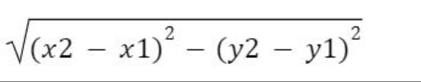
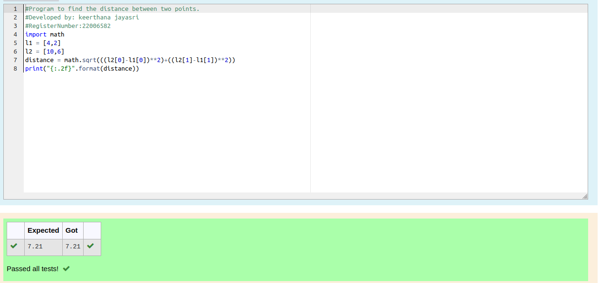

# DISTANCE-BETWEEN-TWO-POINTS

## AIM:
To write a python program to find the distance two 2 points
## ALGORITHM:
### Step 1: 
Using import math function, do the calculations.
### Step 2: 
Take the two coordinates as l1 and l2.
### Step 3: 
Substitute the values in the distance formula  

### Step 4: 
Using the print functions, display the distance between the two points.
### Step 5: 
End the program.

### PROGRAM:
```
distance of two points
developer name:keerthana jayasri s k
regestration number: 22006582
import math
l1 = [4,2]
l2 = [10,6]
distance = math.sqrt(((l2[0]-l1[0])**2)+((l2[1]-l1[1])**2))
print("{:.2f}".format(distance))
```

### OUTPUT:


### RESULT:
Thus the distance of two points is successfully executed and diplayed.

